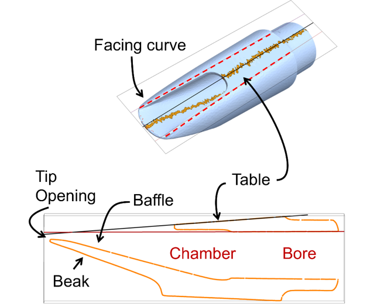

# Quality control and key dimensions

 <b> Tip Opening: </b> The most basic dimension for a saxophone mouthpiece is the tip opening. A make and model typically are offered in a range of tip openings as the only optional dimension, and the mouthpieces are marked with a number denoting the tip opening size. A classical or beginning player typically uses a smaller tip opening, advanced jazz players use medium to medium large tip openings, and rock players use large tip openings. This is only generally true, as other dimensions of the mouthpiece influence the desired tip opening. For tenor saxophones tip openings vary generally 0.060-0.140”, with 0.070-0.120” being a more typical range. For an individual make and model the tip openings move in steps of 0.005” or so, but there is not a uniform standard. 

<b> Facing Curve: </b>The next most common measurement is the facing curve. This is generally not available from the manufacturer but is cataloged individually by refacers and manufacturers. This curve is generally regarded as the most important differentiator between mouthpieces. The most common method for measurement is referred to as the Brand system after Eric Brand. This method consists of measuring the depth at contact of a feeler gauge on a calibrated glass plate. 

<b>Chamber Size:</b> Chamber size is sometimes offered as an option of small, medium, or large from the manufacturer, but is difficult to quantify with standard tooling. Chamber shape can also vary significantly between rectangular and round.
Sidewall shape can be flat and thick or thin and scooped.

<b>Baffle Shape:</b> Baffle shape is very critical to sound, but not well quantified. Shapes can vary from “no baffle”, to rollover in several forms, to a “high baffle” design.

<b>Beak Shape and size:</b> Beak shape and size effects the player’s jaw position, hence has a different effect for different players.

