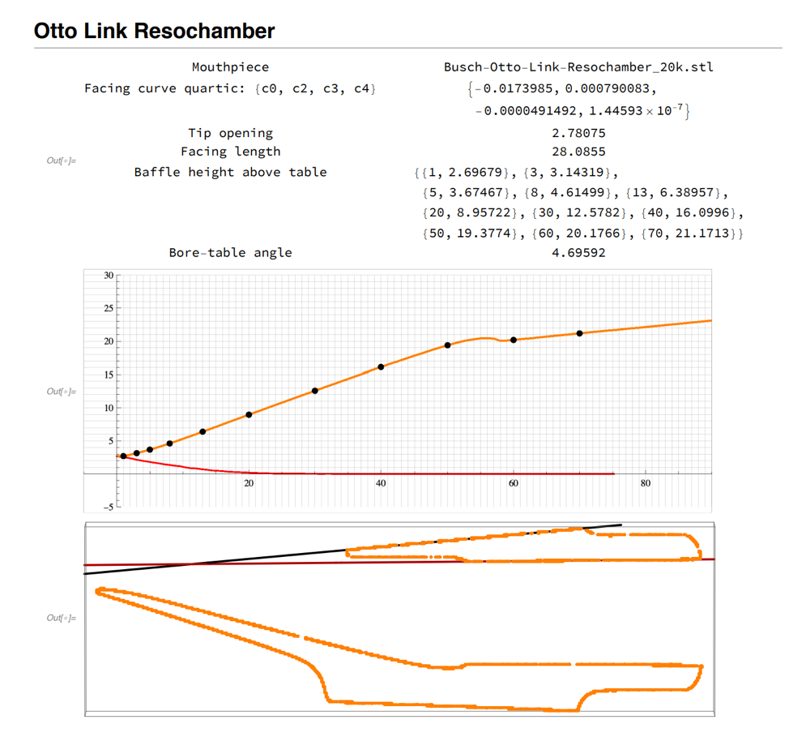

# Workflow

1. **Mouthpiece archival and reproduction**

    1.1. Scan each mouthpiece in the Duke SMIF microCT scanner.
  
    

  This was a very time consuming process. Some scans failed to compile properly and needed to be repeated several times. In the end, useful scans were produced for mouthpiece IDs 2,3,4,5,6,7,8,9,11. 
  

    1.2. Convert scans into stereolithography (stl) files that can be analyzed and/or 3D printed.
    
    

  This was also very time consuming. In the end, Justin Gladman, R&D Engineer at SMIF, completed this file conversion for the project due to his easy access and expertise with the propriety software. Files were created at 2 resolutions, one for maximum fidelity for printing, typically about 1GB, and one for easy manipulation for analysis, about 3MB or less. The files displayed under the Archive tab on this website are the 3MB copies.
  

    
    1.3. Produce some 3D printed copies.
    
    

Copies were produced for mouthpiece IDs 1,2,6,7,8. IDs 1,2, and 6 have shortened shanks for technical reasons, and are of limited use for evaluation.

    
    1.4. Test play and hand finish printed copies in an attempt to produce a usable faithful reproduction.
    

    In general, all copies have some similarity with the original from a players perspective, but none would be regarded an exact copy. Mouthpiece ID 7 was printed 5 times while varying some print parameters and hand finishing techniques of careful sanding on table and rails. Mouthpiece ID 7.1 and 7.3 are pretty good mouthpieces, and very similar to the original but still not quite the same in the opinion of the team.
    

    
2. **Acoustic data collection**

    2.1. Write a questionnaire and instructions for recording.
    

    After much discussion and some trial runs, it was decided to limit the recording to 4 long tones, recorded in 3 takes each for each musician. This resulted in small variations from take to take and eliminated many of the random variations inherent in playing a fragment of a song for example, and it was clear that a time dependent analysis of attack and decay was beyond the scope of this project.
    

    2.2. Survey musicians and record samples of each musician playing each mouthpiece. Recordings are 3 takes of 4 long tones through the middle part of the saxophone range.
    

      Recordings and survey results were compiled from team members as well as local professionals and students. Additional recording sessions needed to be cancelled due to COVID-19.
    

    
    2.3. Extract a set of parameters from each recording that can be used to quantifiably compare each player-mouthpiece combination.
    

    These parameters were devised and compiled based on online research in the field.
    

    
3. **Dimensional analysis**

    3.1. Measure physical properties of material of each mouthpiece.
    

    Measurements of material hardness and density could not discern differences between mouthpieces.
    

    
    3.2. Extract key physical dimensions from scanned files in software.
    

    A Mathematica script was written to extract tip opening, facing curve, baffle profile, and table angle relative to table for mouthpiece ID 2,5,6,7,8,11.  
    

    
    
    
    3.3. Record measurements by hand using traditional tools.
    

    Traditional measurement tools and techniques were used to record tip opening and facing curve for each mouthpiece.
    

    
4. **Comparative analysis**

    4.1. Compile all data in a database that allows for easy comparison.
    

    This website allows users to dynamically generate plots, display stl files, audio, and spectra data. Raw data have been archived for future work.
    

    
    4.2. Perform statistical analysis on dataset.
    

    Values of R^2, P-values, and slope were compiled for all linear combinations of data sets.
    
